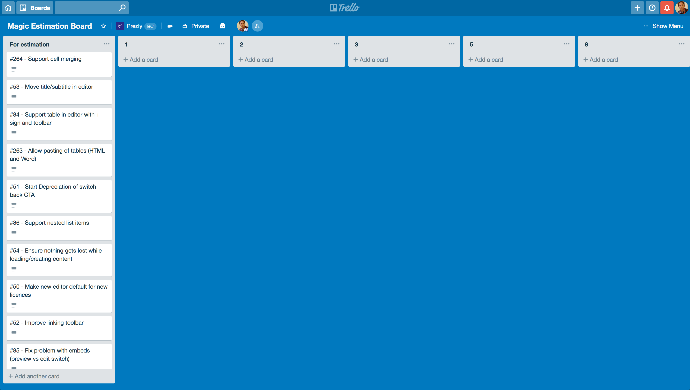
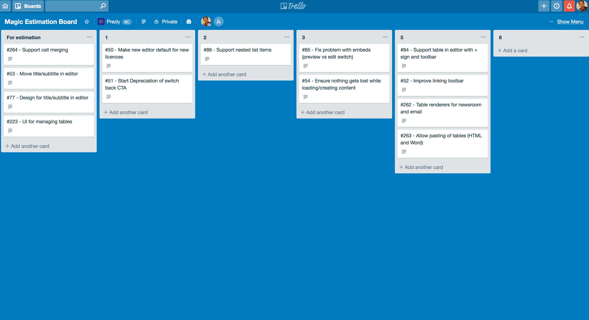
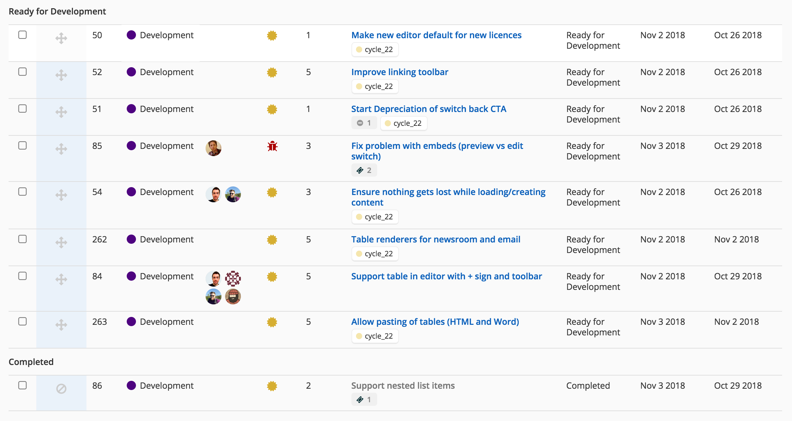

# clubhouse_to_trello

This is a commandline script to use drag-and-drop functionality in trello to estimate story points.
It creates a trello board, creates a few lists (1,2,3,5,8,13) and creates a trello card per story.
 
When you are done you can sync back those scores to clubhouse story points.

## Installing globally

```sh
git clone https://github.com/prezly/clubhouse_to_trello
cd clubhouse_to_trello
npm i
cp .env.example .env
npm install -g ./
```

Make sure to set up environment variables with your trello and api credentials. `cp .env.example .env`

## Local Usage

Now you can run commands like `clubhouse_to_trello create` using your local `clubhouse_to_trello-cli`.

```bash
Usage: clubhouse_to_trello [options] [command]

Options:
  -h, --help            output usage information

Commands:
  start|create_board    Start by creating board and adding the cards
  finish|update_points  Move estimations from trello board back into clubhouse story estimation points
  clean|delete          Clean up the board/cards/list
  test|testconfig       Test your config (connect to trello and clubhouse)
```

## Commands

### create_board

Ask you which EPICs from clubhouse you want to estimate.
Create trello boards `Magic Estimation Board` with lists and cards

### update_points

Read where the cards were moved (which list) and thus which points they get.
Write changes back to clubhouse as story estimation points.

### clean

Remove the trello boards and cards

### testconfig

Checks if your trello and clubhouse credentials (in `.env`) are correct

---

If you want to set up `clubhouse_to_trello` to use a non-production server, you can create a file such as `~/.env.example` where you set some environment variables:

```bash
export TRELLO_API_KEY=changeme0000000
export TRELLO_OAUTH_TOKEN=changeme000000
export CLUBHOUSE_TOKEN=changeme0000000
c2t -h
```

## Magic Estimation

First convert some clubhouse epics to the trello board:

[](https://asciinema.org/a/WMK6pLDaMBV3zpSXnRhaJDoYj)

After creating the board it will look like:



Now drag your stories into the different lists. You can create lists with other numbers if you'd like.



When you are happy hit clubhouse_to_trello finish and cleanup

[](https://asciinema.org/a/CKgojSq8XVETUkoc8wQiapNXI)

Your clubhouse stories should now have estimation points



## License

See LICENSE.md.
